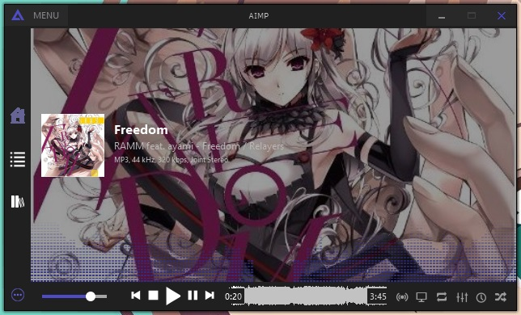
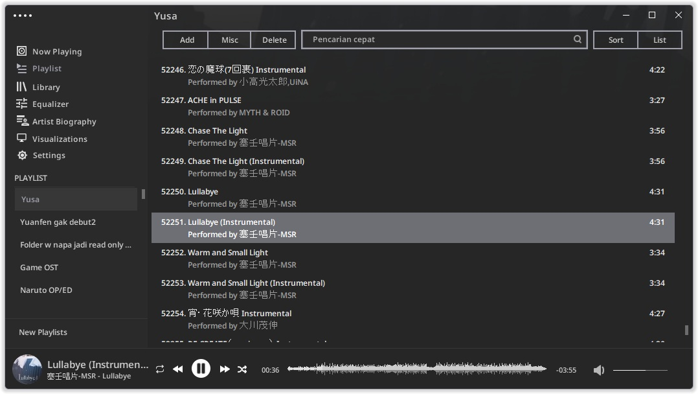

# Nanako Skin
An a simple skin for music player called Aimp

Actually i make this skin for my private use, because someone asked this skin i used on the facebook groups, i post here

## Reference
This skin reference from [Project FX_ by FrostX00001101](https://www.deviantart.com/frostx00001101/art/AIMP-4-Skin-Project-FX-761347205) and Raafi G

## Tools before
+ v0.0.1 Prototype

using skin editor v4.60

+ v1.1.1 until now

 using skin editor 5.30

## Preview of the skin

- V.0.0.1 (ML Library not Changed)

- V.1.1.4

## All resource of the skin
All resource on this skin using from [Google Fonts](https://fonts.google.com)

And for Font using Noto Sans

## Thanks to
+ [Desonime for Project Skin](https://www.deviantart.com/desonime/art/SoundMax-AIMP-Project-File-874776988)
+ [Sukabumi Otaku Network for Project Skin, i explore from here](https://project.smiotaku.my.id/download/source-skin)
+ Kazoe san for testing my skin
